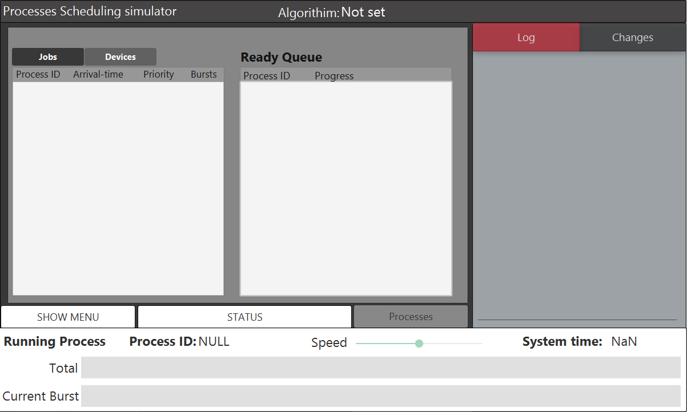
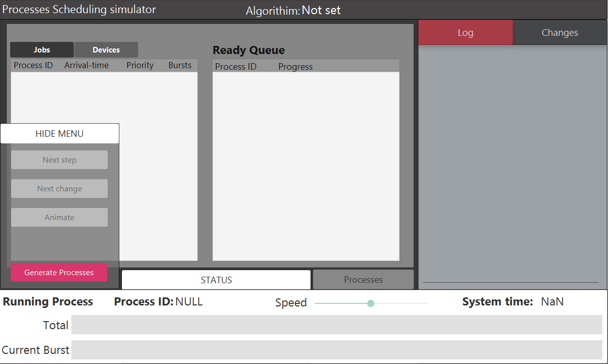
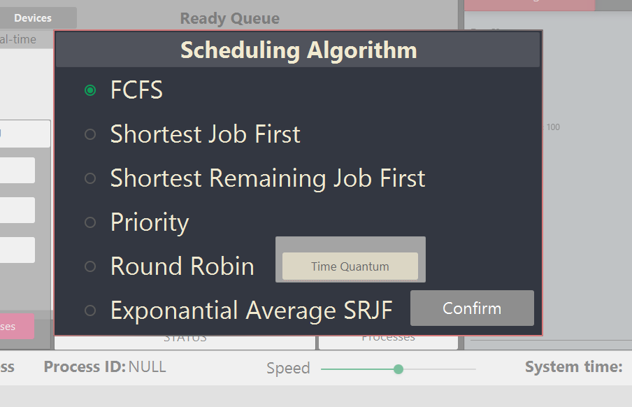
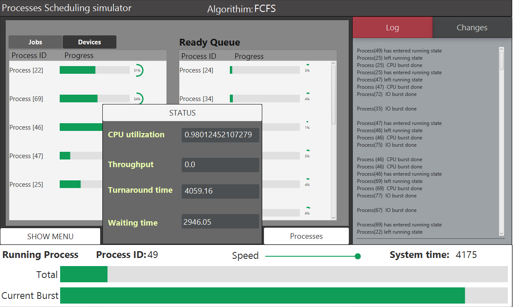

# Operating System CPU Scheduling Algorithms Simulator

[](https://www.oracle.com/java/)
[](https://openjfx.io/)
[](LICENSE)

An interactive educational tool for visualizing and understanding CPU scheduling algorithms used in Operating Systems. This project provides both a command-line interface for algorithm testing and a rich JavaFX-based GUI for educational demonstrations.

## 📋 Table of Contents

- [Features](#features)
- [Implemented Algorithms](#implemented-algorithms)
- [Project Structure](#project-structure)
- [Prerequisites](#prerequisites)
- [Installation & Setup](#installation--setup)
- [Usage](#usage)
- [Architecture](#architecture)
- [Screenshots](#screenshots)
- [Performance Metrics](#performance-metrics)
- [Contributing](#contributing)
- [Authors](#authors)
- [Acknowledgments](#acknowledgments)

## ✨ Features

### Educational Visualization
- **Real-time Queue Visualization**: Watch job queue, device queue, and ready queue evolve over time
- **Step-by-Step Execution**: Move through the simulation one time unit at a time
- **Jump to Changes**: Skip directly to the next significant state change
- **Animation Mode**: Automated playback with adjustable speed controls
- **Comprehensive Logging**: Track all state changes and events in dedicated log windows

### Process Management
- **Custom Job Generation**: Configure all parameters for job stream generation:
  - Number of processes
  - Degree of multiprogramming
  - Burst count per process
  - CPU and I/O burst time ranges
  - Process priority levels
  - Arrival time distribution
  - Context switch overhead
  - Exponential averaging parameters (τ and α)

### Performance Analytics
- **Real-time Metrics**:
  - CPU Utilization
  - System Throughput
  - Average Turnaround Time
  - Average Waiting Time
- **Per-Process Statistics**: View waiting and turnaround times for individual processes
- **Progress Tracking**: 
  - Current burst progress bar
  - Overall process completion indicator

## 🔄 Implemented Algorithms

The simulator supports six major CPU scheduling algorithms:

1. **First-Come, First-Served (FCFS)**
   - Non-preemptive
   - Processes executed in arrival order
   - Simple but can cause convoy effect

2. **Shortest Job First (SJF)**
   - Non-preemptive
   - Selects process with shortest CPU burst
   - Optimal for minimizing average waiting time

3. **Shortest Remaining Time First (SRTF)**
   - Preemptive version of SJF
   - Can preempt currently running process
   - Requires knowledge of remaining burst time

4. **Priority Scheduling**
   - Supports both preemptive and non-preemptive modes
   - Lower priority number = higher priority
   - Risk of starvation for low-priority processes

5. **Round Robin (RR)**
   - Preemptive with time quantum
   - Fair allocation of CPU time
   - Performance depends on time quantum selection

6. **Exponential Averaging (Predicted SJF)**
   - Uses exponential averaging to predict next CPU burst
   - Formula: τₙ₊₁ = α × tₙ + (1 - α) × τₙ
   - Balances history and recent behavior

## 📁 Project Structure

```
operating-system-scheduling/
│
├── os-scheduler-ui/              # JavaFX GUI Application
│   ├── src/
│   │   └── application/
│   │       ├── Main.java                    # Application entry point
│   │       ├── Process.java                 # Process model
│   │       ├── Burst.java                   # CPU/IO burst representation
│   │       ├── initialStateController.java  # Job generation controller
│   │       ├── MainSceneController.java     # Main simulation controller
│   │       ├── GenerateSceneController.java # Configuration controller
│   │       ├── PickAlgo.java               # Algorithm selection
│   │       │
│   │       ├── FirstComeFirstServed.java   # FCFS implementation
│   │       ├── ShortestJobFirst.java       # SJF implementation
│   │       ├── ShortestRemainingTimeFirst.java # SRTF implementation
│   │       ├── Priority.java               # Priority scheduling
│   │       ├── RoundRobin.java            # Round Robin
│   │       ├── ExponentialAveraging.java  # Predicted SJF
│   │       │
│   │       ├── SortByArrivalTime.java     # Comparators
│   │       ├── SortByPriority.java
│   │       ├── SortByShortestCPUBurst.java
│   │       ├── SortByExpAveraging.java
│   │       │
│   │       ├── FXMLfile.fxml              # FXML layouts
│   │       ├── GenerateScene.fxml
│   │       ├── MainScene.fxml
│   │       ├── initialState.fxml
│   │       └── application.css            # Styling
│   │
│   ├── bin/                      # Compiled classes
│   ├── build.fxbuild            # JavaFX build configuration
│   └── .classpath               # Eclipse classpath
│
├── os-scheduler-core/           # Command-line version (for testing)
│   ├── src/
│   │   ├── Main.java
│   │   ├── Process.java
│   │   ├── Burst.java
│   │   ├── FirstComeFirstServed.java
│   │   ├── ShortestJobFirst.java
│   │   ├── ShortestRemainingTimeFirst.java
│   │   ├── Priority.java
│   │   ├── RoundRobin.java
│   │   ├── ExponentialAveraging.java
│   │   └── Sort*.java           # Comparator classes
│   │
│   └── bin/                     # Compiled classes
│
├── screenshots/                 # Application screenshots
│   ├── initialScreen.PNG
│   ├── generatingJobs.PNG
│   ├── pickingAnAlgo.PNG
│   └── screenshotInAnimatingMode.PNG
│
├── docs/
│   └── project-report.pdf       # Detailed project documentation
│
├── .env.example                 # Environment configuration template
└── README.md                    # This file
```

## 🔧 Prerequisites

- **Java Development Kit (JDK)**: Version 8 or higher
- **JavaFX SDK**: Bundled with JDK 8, separate for JDK 11+
- **JFoenix Library**: Version 8.0.1 or higher (for Material Design UI components)
- **IDE** (Recommended): 
  - Eclipse with e(fx)clipse plugin
  - IntelliJ IDEA with JavaFX support
  - NetBeans with JavaFX

## 🚀 Installation & Setup

### 1. Clone the Repository

```bash
git clone https://github.com/yourusername/os-scheduling-simulator.git
cd os-scheduling-simulator
```

### 2. Install JFoenix Library

Download JFoenix JAR files:
- [JFoenix 8.0.1](https://github.com/sshahine/JFoenix/releases)
- [JFoenix 9.0.1](https://github.com/sshahine/JFoenix/releases) (optional, for newer features)

### 3. Configure IDE

#### For Eclipse:

1. Import the project: `File → Import → Existing Projects into Workspace`
2. Add JFoenix to build path:
   - Right-click project → `Build Path → Configure Build Path`
   - `Libraries → Add External JARs`
   - Select downloaded JFoenix JAR files
3. Ensure JavaFX is configured (automatic for JDK 8)

#### For IntelliJ IDEA:

1. Open the `os-scheduler-ui` folder as a project
2. Add JFoenix libraries:
   - `File → Project Structure → Libraries → +`
   - Select JFoenix JAR files
3. Configure JavaFX if using JDK 11+:
   - Add VM options: `--module-path /path/to/javafx-sdk/lib --add-modules javafx.controls,javafx.fxml`

### 4. Build and Run

#### GUI Version:
```bash
cd os-scheduler-ui
javac -d bin src/application/*.java
java -cp bin application.Main
```

#### CLI Version:
```bash
cd os-scheduler-core
javac -d bin src/*.java
java -cp bin Main
```

## 📖 Usage

### Starting the Application

1. **Launch the Application**: Run `Main.java` from the `os-scheduler-ui` project
2. **Configure Job Stream**: 
   - Set the number of processes
   - Define arrival time range
   - Configure CPU and I/O burst parameters
   - Set multiprogramming degree
   - Adjust context switch overhead
   - Generate the job stream

3. **Select Algorithm**: Choose one of the six scheduling algorithms

4. **Run Simulation**:
   - **Next Step**: Advance one time unit
   - **Next Change**: Jump to next state transition
   - **Animate**: Auto-play with speed slider control
   - **Pause**: Freeze simulation to analyze current state

5. **Analyze Results**:
   - Monitor queue states in real-time
   - Check performance metrics panel
   - Review log window for detailed events
   - Examine per-process statistics

### Example Workflow

```
1. Generate 10 processes with:
   - Arrival time: 0-20
   - CPU bursts: 3-15 time units
   - I/O bursts: 2-10 time units
   - 3 bursts per process
   - Multiprogramming degree: 3

2. Run Round Robin with quantum = 4

3. Compare with FCFS on same job set

4. Analyze differences in:
   - Average waiting time
   - Turnaround time
   - CPU utilization
```

## 🏗️ Architecture

### Core Components

#### Process Model
```java
class Process {
    int processId;
    int arrivalTime;
    int priority;
    ArrayList<Burst> bursts;
    int currentBurstIndex;
    // Statistics
    int waitingTime;
    int turnaroundTime;
}
```

#### Burst Model
```java
class Burst {
    boolean type;        // true = CPU, false = I/O
    int timeNeeded;      // Total burst time
    int timeWorked;      // Time already processed
}
```

#### Scheduling Interface
Each algorithm implements a common interface for:
- Process admission control
- Ready queue management
- Process selection logic
- Context switching
- Statistics tracking

### Algorithm Flow

```
1. Process Arrival → Job Queue
2. Admission Control (multiprogramming check)
3. Job Queue → Ready Queue (for new process) or Device Queue (for I/O)
4. Scheduler selects process from Ready Queue
5. Process executes (with preemption logic if applicable)
6. Burst completion → Next burst or termination
7. Update statistics and queues
8. Repeat from step 2
```

## 📊 Performance Metrics

The simulator calculates and displays:

### CPU Utilization
```
CPU Utilization = (Total CPU Busy Time / Total Elapsed Time) × 100%
```

### Throughput
```
Throughput = Number of Completed Processes / Total Time
```

### Turnaround Time
```
Turnaround Time = Completion Time - Arrival Time
Average Turnaround = Σ(Turnaround Times) / Number of Processes
```

### Waiting Time
```
Waiting Time = Turnaround Time - Total Burst Time
Average Waiting = Σ(Waiting Times) / Number of Processes
```

## 🖼️ Screenshots

### Initial Configuration Screen

*Configure job generation parameters*

### Job Generation

*View generated process stream with bursts*

### Algorithm Selection

*Choose from six scheduling algorithms*

### Live Simulation

*Real-time visualization with metrics and queue states*

## 🤝 Contributing

Contributions are welcome! Here's how you can help:

1. **Fork the repository**
2. **Create a feature branch**: `git checkout -b feature/AmazingFeature`
3. **Commit changes**: `git commit -m 'Add AmazingFeature'`
4. **Push to branch**: `git push origin feature/AmazingFeature`
5. **Open a Pull Request**

### Ideas for Contribution
- Add more scheduling algorithms (e.g., Multilevel Queue, Multilevel Feedback Queue)
- Implement real-time scheduling algorithms
- Add export functionality for metrics (CSV, charts)
- Create algorithm comparison mode
- Add internationalization support
- Improve UI/UX with modern Material Design components

## 🙏 Acknowledgments

- **JFoenix Community** - For the beautiful Material Design JavaFX library
- **Operating Systems Concepts** by Silberschatz, Galvin, and Gagne - Theoretical foundation

## 📄 License

This project is licensed under the MIT License - see the [LICENSE](LICENSE) file for details.

## 📚 Additional Resources

- [Project Report](docs/project-report.pdf) - Detailed technical documentation
- [JavaFX Documentation](https://openjfx.io/)
- [JFoenix GitHub](https://github.com/sshahine/JFoenix)
- [OS Scheduling Algorithms Theory](https://www.geeksforgeeks.org/cpu-scheduling-in-operating-systems/)

## 🐛 Known Issues

- Time complexity may increase with large numbers of processes (>1000)
- UI may lag during animation with very small time quanta
- Context switch overhead visualization could be more detailed

---

**Note**: This is an educational project designed for learning Operating System concepts. For production systems, use OS-native schedulers and consider additional factors like thread scheduling, real-time constraints, and hardware-specific optimizations.

## 📞 Support

For questions or issues:
- Open an issue on GitHub
- Contact the authors via GitHub profiles
- Check the project report for detailed explanations

**Star ⭐ this repository if you found it helpful!**
